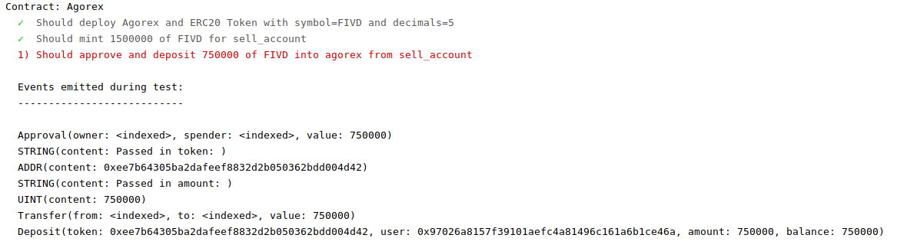

# Smart Contract

This is a repo for the GoChainDelta smart contract, heavily derived from the Agorex smart contract repo .
All contracts are located in the `contracts` folder.

## Summary
- [Development Overview](#development-overview)
  - [Development Environment](#development-environment)
  - [Deploying to Ethereum Mainnet](#deploying-to-the-ethereum-mainnet)
  - [Deploying to Rinkeby Testnet](#deploying-to-rinkeby-testnet)
  - [Migrating and Testing with Ganache](#migrating-and-testing-with-ganache)
       - [Debugging Workflow](#debugging-workflow)
       - [Common Problems and Fixes](#common-problems-and-fixes)


## Development Overview

There are two networks that this repo can deploy to: 
- Mainnet: **GoChain**
- Local Testnet: **Ganache**

Use the local testnet for testing changes to the SC, and use the mainnet deploy when you are ready to deploy to production. 

### Development Environment
**Requirements:**
* Node.js (https://nodejs.org/en/)
* git client (https://git-scm.com/download/)

**Setup:**
1. Fill out the information in [GODELTA_CONFIG.json](./GODELTA_CONFIG.json)
2. Navigate into the root directory: `cd smart_contract_gary`
3. Install necessary requirements from package.json: `npm install`
4. (*optional*) If you use VSCode, copy [./.vscode/settings.json.default](./.vscode/settings.json.default) to [./.vscode/settings.json](./.vscode/settings.json) for a reasonable solhint linter configuration

### Deploying to the Mainnet
1. Edit the *live* section in [truffle.js](./truffle.js):
    * Set reasonable gas price based on https://ethgasstation.info. Since you're using gochain, you may just want to stick with defaults unless you know optimal gas prices on gochain.
    * Start local gochain node (geth/parity) and set the connection parameters (host and port) in the *live* section.
    * Set the "from" account in the live section to match the **DEPLOYER_CONFIG.public_key** found in [GODELTA_CONFIG.json](./GODELTA_CONFIG.json).
2. Verify creation accounts parameters for EtherDelta contract in [GODELTA_CONFIG.json](./GODELTA_CONFIG.json)
3. Unlock account that is used for deploying the contract: `npm run-script unlock` (will unlock account for 3 minutes)  
4. Deploy Etherdelta.sol to mainnet: `npm run-script migrate`

### Migrating and Testing with Ganache
1. Start local ganache testnet on *localhost:9545* using `npm start`
2. Unlock local accounts using `npm run-script unlock_g`
3. Deploy contracts to testnet using `npm run-script migrate_g`
4. Run tests located in the [test](./test) directory using `npm run-script test_g`

#### Debugging Workflow
Whenever a test is run using `npm run-script test_g`, the .js files found in [test](./test) are run. These tests follow the Mocha framework, and a simple example of how to write them can be found [here](https://truffleframework.com/docs/getting_started/javascript-tests) (we are using async tests).

One of the easiest ways to debug the smart contract is to add the lines to the events in [Etherdelta.sol](./contracts/Etherdelta.sol):
```
// Debugging Events
event BOOL(bool content);
event UINT(uint content);
event ADDR(address content);
event STRING(string content);
``` 

Whenever you run a test and call the `depositToken()` Etherdelta smart contract method in a JavaScript file, like 
```javascript
await etherdelta.depositToken(alpha_token.contract.address, amount_to_deposit, {from: sell_account});
```
The truffle console will show you any events emitted during the event *iff* the test fails.

The current Etherdelta.sol `depositToken()` method looks like this, 
```solidity
function depositToken(address token, uint amount) public {
        require(token != 0);
        depositingTokenFlag = true;
        require(IToken(token).transferFrom(msg.sender, address(this), amount));
        depositingTokenFlag = false;
        tokens[msg.sender][token] = tokens[msg.sender][token].add(amount);
        emit Deposit(token, msg.sender, amount, tokens[msg.sender][token]);
    }
```
If you wanted to verify that the arguments that you passed in are correctly being sent to the smart contract, you could use the debug events as follows:
```solidity
function depositToken(address token, uint amount) public {
        emit STRING("Passed in token: ");
        emit ADDR(token);
        emit STRING("PASSED in token: ");
        emit UINT(amount);
        require(token != 0);
        depositingTokenFlag = true;
        require(IToken(token).transferFrom(msg.sender, address(this), amount));
        depositingTokenFlag = false;
        tokens[msg.sender][token] = tokens[msg.sender][token].add(amount);
        emit Deposit(token, msg.sender, amount, tokens[msg.sender][token]);
    }
``` 
If the Mocha test containing the Javascript `depositToken()` call failed, you will be able to see the events emitted during the function call, like the screenshot below demonstrates.


#### Common Problems and Fixes
- Restart the ganache-cli instance started using the `npm start` command (use ctrl+c in the CLI window to close) when you run out of funds on testing accounts and receive insufficient eth errors.
- Delete the [build](./build) directory and its contents if you make changes to a smart contract and they aren't being reflected in tests and/or migrations.
- Remember to unlock your account before running migrations. 